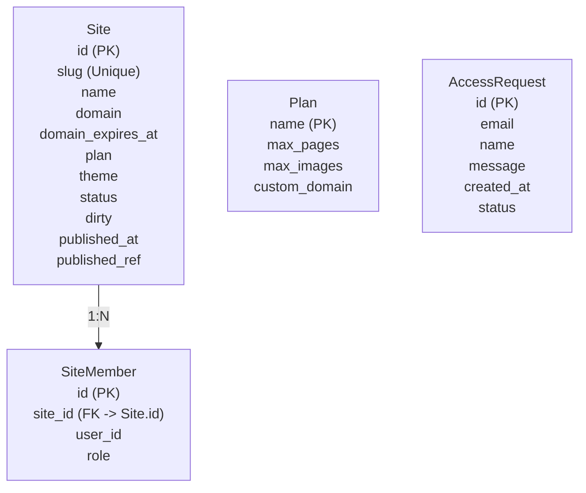

# Diagrams — Database ERD

```mermaid
flowchart TD
    Site["Site<br/>id (PK)<br/>slug (Unique)<br/>name<br/>domain<br/>domain_expires_at<br/>plan<br/>theme<br/>status<br/>dirty<br/>published_at<br/>published_ref"]
    SiteMember["SiteMember<br/>id (PK)<br/>site_id (FK -> Site.id)<br/>user_id<br/>role"]
    Plan["Plan<br/>name (PK)<br/>max_pages<br/>max_images<br/>custom_domain"]
    AccessRequest["AccessRequest<br/>id (PK)<br/>email<br/>name<br/>message<br/>created_at<br/>status"]

    Site -->|1:N| SiteMember
```
